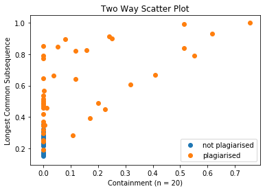
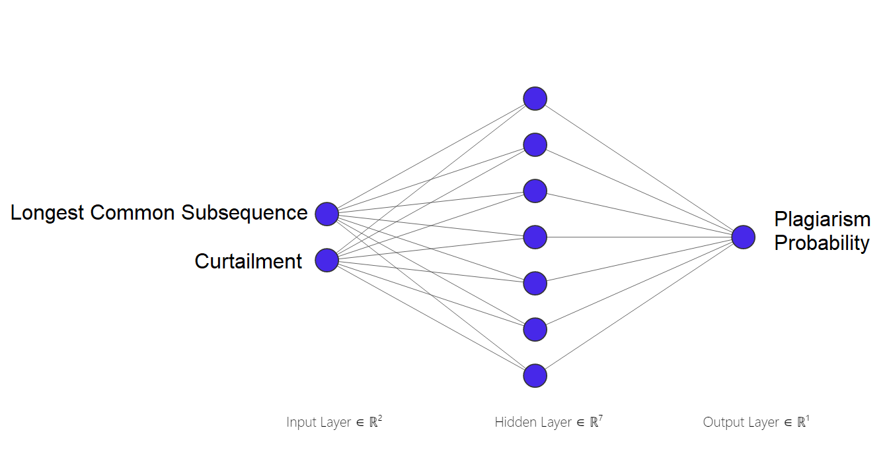
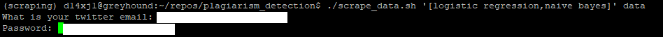

# Plagiarism Detection with PyTorch
The aim of this project is to use machine learning to identify plagiarism in articles written about Data Science on the Medium platform. My motivation for doing this was purely intellectual - could I do it? I have no interest in shaming/ousting people that commit plagiarism. Here are some examples flagged by our neural network.

* **Logistic Regression:** [Article A](https://towardsdatascience.com/why-linear-regression-is-not-suitable-for-binary-classification-c64457be8e28?source=search_post) vs [Article B.](https://medium.com/@elenjubbas/linear-regression-vs-logistic-regression-for-classification-tasks-b42f85487857?source=search_post)

* **Naive Bayes:** [Article A](https://medium.com/@mahjahnavi/natural-language-processing-an-overview-of-key-algorithms-and-their-evolution-2d9612d1f764?source=search_post) vs [Article B.](https://medium.com/reality-engines/natural-language-processing-an-overview-of-key-algorithms-and-their-evolution-3588d2cef90f?source=search_post)

* **Random Forest:** [Article A](https://medium.com/datadriveninvestor/ensemble-learning-and-random-forest-7430ebf3da7e?source=search_post) vs [Article B.](https://medium.com/@Synced/how-random-forest-algorithm-works-in-machine-learning-3c0fe15b6674?source=search_post)

* **Xgboost:** [Article A](https://towardsdatascience.com/boosting-performance-with-xgboost-b4a8deadede7?source=search_post) vs [Article B.](https://medium.com/@knoldus/machinex-boosting-performance-with-xgboost-28c9f49998a6?source=search_post)

More examples can be found in the [results section](notebooks/2_results.ipynb)

# How I did it
As part of the Udacity Machine Learning Engineer Nanodegree I was introduced to a dataset containing simulated plagiarised answers to a series of computer science questions. I used this dataset to build a binary classifier in PyTorch, which I then applied to data science articles scraped from the Medium Platform.

## Source Data

Researchers at the University of Sheffield created a corpus in which plagiarism has been simulated:

>Plagiarism is widely acknowledged to be a significant and increasing problem for higher education institutions. To test and develop systems to detect plagiarism, evaluation resources are required. To address this, we created a corpus consisting of short (200-300 words) answers to Computer Science questions in which plagiarism has been simulated. The corpus has been designed to represent varying degrees of plagiarism and we envisage will be a useful addition to the set of resources available for the evaluation of plagiarism detection systems. 

> **Citation for data**: Clough, P. and Stevenson, M. Developing A Corpus of Plagiarised Short Answers, Language Resources and Evaluation: Special Issue on Plagiarism and Authorship Analysis, In Press. [Download](https://ir.shef.ac.uk/cloughie/resources/plagiarism_corpus.html)

The dataset contains a mixture of plagiarised and non-plagiarised answers. During the creation of the non-plagiarised answers the Wikepedia source text was not referred to. For the plagiarised answers there were three levels of plagiarism

1) *cut:* answer copy-pasted directly from the relevant Wikipedia source text.
2) *light:* answer based on the Wikipedia source text and includes some copying and paraphrasing.
3) *heavy:* answer based on the Wikipedia source text but expressed using different words and structure. 

To understand this data further see the section on [Data Exploration](udacity/Solutions/1_Data_Exploration.ipynb)

## Feature Engineering

In the [Feature Engineering](udacity/Solutions/2_Plagiarism_Feature_Engineering.ipynb) stage I used two similarity metrics to compare the student answers to the Wikepedia source text. 
1) [Containment](https://www.youtube.com/watch?time_continue=103&v=FwmT_7fICn0&feature=emb_logo)
2) [Longest Commmon Subsequence](https://www.youtube.com/watch?time_continue=37&v=yxXXwBKeYvU&feature=emb_logo)

The links provided above give a short two minute explanation for each metric.

Both metrics are normalised to be between zero and one. We would expect that plagiarised answers would have high values for one or more of these metrics.

A two way scatter suggests these will be useful features in a model to predict plagiarism.

<p align="center">
  
</p>

## Modelling

Next I used Amazon Sagemaker and PyTorch to create a neural network to predict the probaiblity plagiarism [which achieved 96% accuracy, 100% precision and 94% recall on a test set.](udacity/Solutions/3_Training_a_Model.ipynb) I used a fully connected feed forward network with 2 input units, 7 hidden layers and 1 output layer.



Since the input feature space is two dimensional we can visualise the classification boundary.

<p align="center">
  
</p>

Red is low probability, Blue is high. We can see that high values of the features are associated with a high probability of plagiarism.

## Application to Medium Articles
Now we have a trained plagiarism model we can apply it to another set of documents. All we need to do is compute the relevant similarity metrics and pass these to the model's predict function.

Throughout the Udacity project I was itching to apply the techniques to another "real life" dataset. I thought the content sharing platform Medium would provide a rich source of data - and decided to look for plagiarism in articles written about data science. In order to do this I build a web scraper using a combination of Selelium and Beautiful soup that could log in to Medium using a twitter handle (you need a paid subscription to access all the articles) and download all articles for a specific search term. 

Sagemaker allows you to easily deploy your model as a web service, however that is overkill for our exploratory investigation. Additionally since we are comparing hundreds of articles pairwise  we would be making many thousands of model predictions. I didn't want to pay for an API endpoint to make these predictions and therefore [re-did the modelling  locally without Sagemaker](notebooks/1_train_model.ipynb).

Using this saved PyTorch model I [brought back the top 5 most likely article combinations to contain plagiarism](notebooks/2_results.ipynb)

### Methods Used
* Webscraping (Selenium, Beautiful Soup, Docker)
* Neural Networks (PyTorch)
* Deployment (AWS Sagemaker)

### Technologies
* Python

### Tests
Tests can be run from the main directory using
```
python -m unittest discover
```

# Who might want to use this project
Anyone wanting to scrape Medium and search for plagiarism

# Set up Instructions
First create a virtual environment and install the dependencies found in requirements.txt. You may need to install PyTorch manually - to do this follow the instructions here https://pytorch.org/get-started/locally/

To perform web scraping you will need a selenium docker image. If required install docker as per https://docs.docker.com/install/linux/docker-ce/ubuntu/.

To start the selenium webserver run

`sudo docker run -d --rm --name standalone-firefox -p 4444:4444 -p 5900:5900 --shm-size 2g selenium/standalone-firefox-debug:3.141.59`

If you would like to see the webscraping happening on a browser (perhaps to debug or just because it looks cool to see your browser automated) then install VNC Viewer https://www.realvnc.com/en/connect/download/viewer/ and point it at your machine. 

We have separated the webscraping from the feature engineering phase, since the later is much more computationally intensive and benefits from multiple cores (we take advantage of parallel processing when calculating similarity features). So first start off with a low spec machine and launch the shell script

`./scrape_data.sh '[logistic regression,naive bayes]' data`

The first argument specifies the search terms. It is important to remember not to include leading spaces here. The second argument is the name of the directory that you would like to store the search results. If that directory does not exist it will be created for you.

Having launched that scipt you will be asked to log in to medium using your twitter handle. (Before doing this please consult Medium's terms and conditions)



Once the data has been downloaded it is advisable to scale up your machine with as many cores as possible. Next begin the feature engineering phase by running the following

`./check_plagiarism.sh '[logistic regression,naive bayes]' data`

A progress bar will indicate how long you will have to wait. For reference on a F series Azure virtual machine with 32 cores it took 14 hours to calculate the longest common subsequence for the xgboost articles. Containment is calculated using vectorised operations and therefore is much faster - circa 5 minutes!


Finally train your own PyTorch classifier by running [this notebook](notebooks/1_train_model.ipynb) and examine the results using [this notebook](notebooks/2_results.ipynb)

## Contact
* tony@statcore.co.uk
